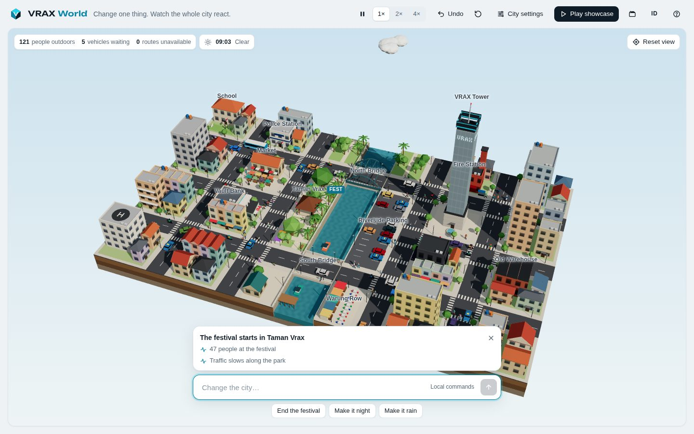
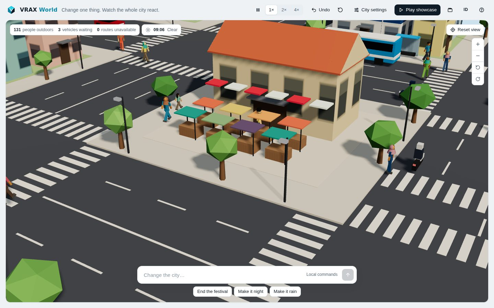
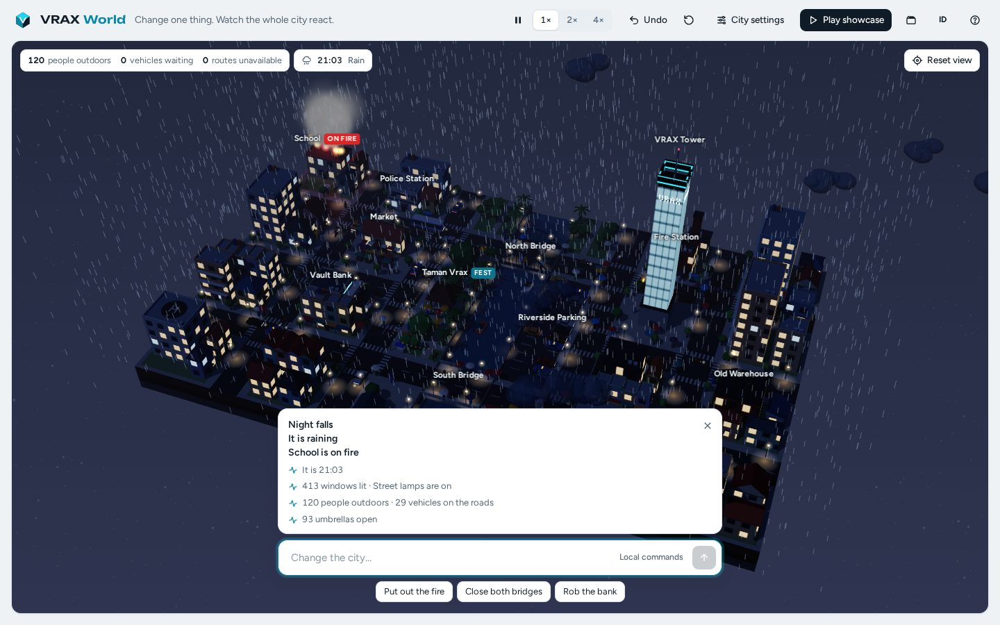

# VRAX World

**Change one thing. Watch the whole city react.**

VRAX World is a miniature city sandbox that runs in the browser. People, traffic, weather, the river and light share one simulation, so a single change ripples through everything: close a bridge and traffic queues at the barrier, make it rain and umbrellas go up while the streets empty, set the school on fire and the fire trucks race over whichever bridge is still open.

You change the city by typing, in **English or Bahasa Indonesia**. A rule-based interpreter reads the command locally: no AI model, no network calls.







## Run it

From the repository root (Node.js 18+, no install needed):

```bash
npm run world              # or: node bin/inz.js world
# → http://127.0.0.1:5173/
```

Options: `--port 8080`, and `--host 0.0.0.0` to open it on your phone over the local network.

Any static file server works too, because there is no build step:

```bash
cd packages/vrax-world
python3 -m http.server 5173
```

The page loads three.js from jsDelivr, so the first visit needs an internet connection.

## Things to try

| English | Bahasa Indonesia |
|---------|------------------|
| Make it rain | Bikin hujan dong |
| Close the north bridge | Tutup jembatan utara |
| Reopen it | Buka lagi |
| Raise the river by 50 cm | Naikkan sungai setengah meter |
| Flood the city | Banjirkan kota |
| Rob the bank | Rampok bank |
| Set the school on fire | Bakar sekolah |
| Put out the fire | Padamkan api |
| Start a festival | Mulai festival / Pasar malam |
| Turn the parking into a park | Ubah parkiran jadi taman |
| Make it night and blackout | Jadikan malam dan mati lampu |
| At 8 pm | Jam 8 malam |
| Make it snow | Bikin salju |
| Rush hour | Bikin macet |
| Light up the tower | Nyalakan menara |
| Play some music / Mute | Nyalakan musik / Matikan suara |

The interpreter understands paraphrases, place names, amounts (`50 cm`, `setengah meter`), clock times, “this/ini” for the place you clicked, “it/itu” for the last thing you changed, and several changes joined with “and/dan”. When a command is ambiguous (“close the bridge”) it asks which one. When something is outside the sandbox (“earthquake”) it says so and suggests what it can do.

## What reacts to what

| Change | What follows |
|--------|--------------|
| Close a bridge | Drivers reroute over the other bridge; if both are shut, some queue at the barrier, wait, then U-turn. Pedestrians lose the crossing too. |
| Rain / storm | People without umbrellas duck into the nearest building, umbrellas open, traffic slows, roads turn glossy, fires burn down faster. |
| River level | Above +60 cm boats can no longer pass under the bridges. At +1.8 m the park, parking, pier and warung flood. At +2.2 m the riverside roads and bridge approaches close. Below −70 cm boats run aground. |
| Fire | Everyone inside evacuates, onlookers gather, two fire trucks leave the Fire Station on the east bank. If the bridges are closed they cannot get through, and a fire left alone can jump to the next building. |
| Bank robbery | Robbers run for the getaway car, which heads for an exit across the river. Police leave the station on the west bank and a patrol comes in from the exit. Closing bridges mid-chase changes the ending. |
| Festival | Crowds head to the pendopo in Taman Vrax, traffic slows along the park, and at night the sky fills with fireworks. |
| Blackout | Windows and street lamps go dark, people come out with phone torches, and only VRAX Tower stays lit on backup power. |
| Time of day / season | Sun, shadows, window lights and street lamps follow the clock. Winter covers roofs and parks in snow; autumn turns the trees. |

Traffic keeps left, as in Indonesia. Streets are built to real proportions: two 3.5 m lanes each way, 3 m sidewalks and wide corner turns. Motorbikes and the TransVrax bus keep to the kerb lane, cars and taxis pick either lane, turns that don't cross go through a junction together, and nobody enters a junction when the road beyond it is backed up. Nobody drives through anybody: drivers keep their distance along their own path, even mid-turn, wait behind the zebra at a junction, and stop for people on it; people wait at the kerb for a car that is close, and let a driver through who has been waiting. Residents walk with swinging arms and legs; some wear a hijab or a peci, and some are kids on their way to school.

Riverside Parking has two rows of stalls either side of a two-way aisle, with its driveway as the fourth arm of the junction on the riverside road. Cars drive in nose first and back out before leaving; people walk around the lot on the sidewalk and cross the driveway on a zebra. Turned into a garden, it opens once the last car has gone.

## Sound

The soundtrack is written live in the browser and follows the city. A sunny day gets lo-fi keys and a kalimba, rush hour a busier groove, the evening a warmer lo-fi, the night brushed jazz with a bamboo flute, rain soft piano, snow a music box. A festival switches to gamelan in slendro tuning: saron on the beat, bonang interlocking above, kendang, kenong and a big gong closing each sixteen-beat cycle. A fire or a police chase turns it tense; a blackout leaves a few plucked notes by candlelight; the tower light show brings synthwave.

The city has its own sounds under the music: traffic that swells as the camera comes closer, horns from drivers stuck too long, police and fire-engine sirens that pan with the vehicle, birds and turtle doves by day, crickets at night, frogs on rainy nights, rain, wind, thunder after each lightning strike, crackling fires, fireworks that boom a moment after the flash, and the festival crowd.

Nothing is loaded from files: every note and noise is synthesised with the Web Audio API. Browsers only allow sound after a tap or key press, so it starts on your first touch. The speaker button or `M` switches it off, and City settings hold the music switch and the music and city volumes. Commands work too: “play some music”, “stop the music”, “mute”, “louder” / “nyalakan musik”, “matikan musik”, “matikan suara”, “keraskan musik”.

## Controls

- **Click** a person, vehicle, building or place name to see what it is doing and what you can do with it.
- A person's card can **Jail** them (a patrol car comes, officers walk them to it and they sit four hours in a cell at the Police Station, whose card can release everyone) or **Kill** them (they fall, onlookers gather and the police come for the body). Closed bridges can keep the patrol from getting there.
- **Phone:** drag to move, pinch to zoom, twist two fingers to turn, drag two fingers up or down to tilt, double-tap to zoom in. Gestures also work when a finger lands on a place label.
- **Mouse:** drag to move, scroll to zoom at the cursor, right-drag (or Shift-drag) to turn and tilt.
- **Buttons** under Reset view zoom and turn the camera; hold them to keep going.
- **City settings** hold weather, river level, time of day, season and the day cycle, plus the music switch and the music and city volumes.
- **Speaker button** switches all sound on or off.
- **Undo** restores the whole city, including randomness, to the moment before your last change.
- **Play showcase** runs a 40-second guided tour and puts everything back afterwards.
- Keyboard: `Space` pause, `Z` undo, `C` cinema mode, `M` sound on/off, `/` type a command, `↑ ↓` command history, `+ −` zoom, `[ ]` turn, `0` reset view, `?` help, `Esc` close.

## How it is built

Plain ES modules with no build step. Everything except three.js is written from scratch.

```text
packages/vrax-world/
├── index.html, style.css
└── src/
    ├── main.js            app wiring: state, undo, showcase, main loop
    ├── interpreter.js     EN/ID rule-based command parser (pure)
    ├── i18n.js            interface text in English and Bahasa Indonesia
    ├── world/layout.js    lane and sidewalk sizes, blocks, river, buildings, landmarks
    ├── world/world.js     derived world: doors, pedestrian grid, road graph
    ├── sim/               simulation (no three.js, runs in Node)
    │   ├── nav.js         1 m walk grid, A*, line-of-sight smoothing
    │   ├── roads.js       road graph, Dijkstra, left-hand lane polylines
    │   ├── people.js      residents, plans, outdoor targets, shelter
    │   ├── vehicles.js    traffic, lanes, junction reservations, closures, buses
    │   ├── events.js      fire, robbery, festival crowds, boats
    │   ├── police.js      arrests, killings and the cells, from a person's card
    │   ├── actions.js     applies one command, reports what changed
    │   └── state.js, step.js, rng.js, common.js
    ├── render/            three.js scene, city meshes, people, vehicles, effects, camera
    ├── audio/             sound, synthesised live with Web Audio (no audio files)
    │   ├── engine.js      mixer, reverb, noise and the instruments
    │   ├── music.js       moods, chords, grooves, the tune writer and the gamelan cycle
    │   ├── city.js        ambience and effects that follow the simulation
    │   └── sound.js       switches, volumes, first-tap start
    └── ui/                DOM interface and the sentences it shows
```

- **State is plain data.** The whole city, including the seeded RNG, fits in one object, so `structuredClone` gives an exact snapshot for undo and the showcase.
- **The simulation runs without a browser.** `test/vrax-world.test.js` builds the world in Node, runs the clock, closes bridges, starts fires and checks the outcomes.
- **Sound reads state every frame too.** The mood comes from the city (`moodFor`), changes land on the next bar, and city sounds are placed left or right of the camera and get louder as it comes closer.
- **Rendering reads state every frame.** Merged geometry for the city, instanced vehicles, and a small shader patch that adds snow on upward faces and a wet look on roads.
- **One draw call for the whole crowd.** Every resident is an instance of a single low-poly figure; a vertex shader swings the arms and legs and picks the clothes, skin, hair or hijab colours per instance.

## Tests

```bash
npm test                          # whole repository
node --test test/vrax-world.test.js
```

## Deploy

It is a static folder. For Cloudflare Pages:

```bash
npx wrangler pages deploy packages/vrax-world --project-name vrax-world
```

GitHub Pages, Netlify or any static host works the same way.

## Ringkasan (Bahasa Indonesia)

VRAX World adalah kota mini di browser. Warga, lalu lintas, cuaca, sungai dan cahaya berbagi satu simulasi, jadi satu perubahan kecil merambat ke mana-mana. Ketik perintah dalam Bahasa Indonesia atau Inggris, misalnya “tutup jembatan utara”, “bikin hujan”, “rampok bank” atau “jam 8 malam dan mati lampu”. Semua perintah diproses lokal oleh penerjemah berbasis aturan, tanpa model AI dan tanpa internet. Musiknya dibuat langsung di browser dan mengikuti suasana kota: lo-fi saat siang, jazz di malam hari, piano saat hujan, gamelan saat festival, tegang saat kebakaran. Suara kota (lalu lintas, klakson, sirene, burung, jangkrik, hujan, petir, kembang api) makin terdengar saat kamera mendekat; tombol speaker atau `M` untuk mematikannya. Jalankan dengan `npm run world` dari root repo, lalu buka `http://127.0.0.1:5173/`.

## Credits

Inspired by the [Small World](https://small-world.dominikmartn.workers.dev/) sandbox. VRAX World is an independent implementation: its city, simulation, interpreter and code are its own.

Part of the [INZ Ecosystem](../../README.md) by [@fahnovinz](https://github.com/fahnovinz). MIT licensed.
